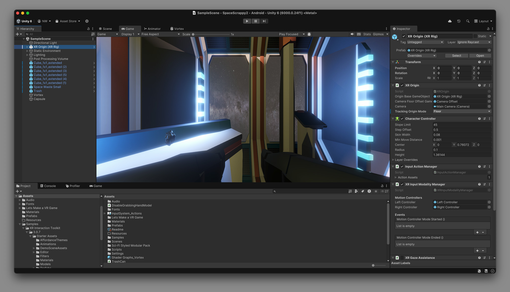

     
       _________                                
      /   _____/__________    ____  ___________ 
      \_____  \\____ \__  \ _/ ___\/ __ \_  __ \
      /        \  |_> > __ \\  \__\  ___/|  | \/
     /_______  /   __(____  /\___  >___  >__|   
             \/|__|       \/     \/    \/
     
# Spacer

This is an example VR project for the Unity game engine. It is a simple game where the player must navigate a spaceship through a series of obstacles. The player can control the view by moving their head and pick up objects using the trigger button on the VR controllers.

